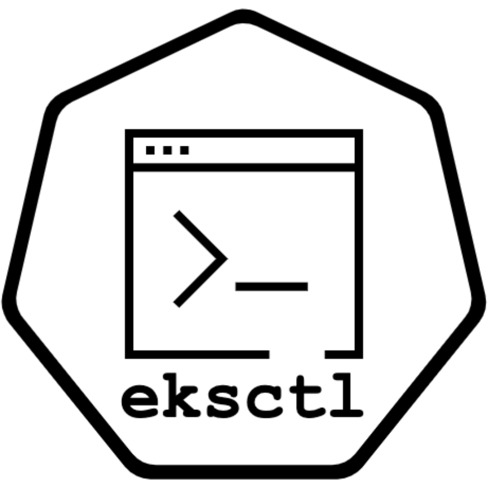

# `eksctl` - The official CLI for Amazon EKS ! 

[](https://goreportcard.com/report/github.com/eksctl-io/eksctl)

`eksctl` is a simple CLI tool for creating clusters on EKS - Amazon's new managed Kubernetes service for EC2. It is written in Go, and uses CloudFormation.

You can create a cluster in minutes with just one command – **`eksctl create cluster`**!


_Need help? Join [Eksctl Slack][slackjoin]._

## Installation

`eksctl` is available to install from official releases as described below. We recommend that you install `eksctl` from only the official GitHub releases. You may opt to use a third-party installer, but please be advised that AWS does not maintain nor support these methods of installation. Use them at your own discretion.

### For Unix

To download the latest release, run:

```sh
# for ARM systems, set ARCH to: `arm64`, `armv6` or `armv7`
ARCH=amd64
PLATFORM=$(uname -s)_$ARCH

curl -sLO "https://github.com/eksctl-io/eksctl/releases/latest/download/eksctl_$PLATFORM.tar.gz"

# (Optional) Verify checksum
curl -sL "https://github.com/eksctl-io/eksctl/releases/latest/download/eksctl_checksums.txt" | grep $PLATFORM | sha256sum --check

tar -xzf eksctl_$PLATFORM.tar.gz -C /tmp && rm eksctl_$PLATFORM.tar.gz

sudo mv /tmp/eksctl /usr/local/bin
```

### For Windows

#### Direct download (latest release): [AMD64/x86_64](https://github.com/eksctl-io/eksctl/releases/latest/download/eksctl_windows_amd64.zip) - [ARMv6](https://github.com/eksctl-io/eksctl/releases/latest/download/eksctl_windows_armv6.zip) - [ARMv7](https://github.com/eksctl-io/eksctl/releases/latest/download/eksctl_windows_armv7.zip) - [ARM64](https://github.com/eksctl-io/eksctl/releases/latest/download/eksctl_windows_arm64.zip)

Make sure to unzip the archive to a folder in the `PATH` variable.

Optionally, verify the checksum:

1. Download the checksum file: [latest](https://github.com/eksctl-io/eksctl/releases/latest/download/eksctl_checksums.txt)
2. Use Command Prompt to manually compare `CertUtil`'s output to the checksum file downloaded.

  ```cmd
  REM Replace amd64 with armv6, armv7 or arm64
  CertUtil -hashfile eksctl_Windows_amd64.zip SHA256
  ```

3. Using PowerShell to automate the verification using the `-eq` operator to get a `True` or `False` result:

```pwsh
# Replace amd64 with armv6, armv7 or arm64
 (Get-FileHash -Algorithm SHA256 .\eksctl_Windows_amd64.zip).Hash -eq ((Get-Content .\eksctl_checksums.txt) -match 'eksctl_Windows_amd64.zip' -split ' ')[0]
 ```

#### Using Git Bash

```sh
# for ARM systems, set ARCH to: `arm64`, `armv6` or `armv7`
ARCH=amd64
PLATFORM=windows_$ARCH

curl -sLO "https://github.com/eksctl-io/eksctl/releases/latest/download/eksctl_$PLATFORM.zip"

# (Optional) Verify checksum
curl -sL "https://github.com/eksctl-io/eksctl/releases/latest/download/eksctl_checksums.txt" | grep $PLATFORM | sha256sum --check

unzip eksctl_$PLATFORM.zip -d $HOME/bin

rm eksctl_$PLATFORM.zip
```

The `eksctl` executable is placed in `$HOME/bin`, which is in `$PATH` from Git Bash.

### Docker

For every release and RC a container image is pushed to ECR repository `public.ecr.aws/eksctl/eksctl`. Learn more about the usage on [ECR Public Gallery - eksctl](https://gallery.ecr.aws/eksctl/eksctl). For example,

```bash
docker run --rm -it public.ecr.aws/eksctl/eksctl version
```

### Third-Party Installers (Not Recommended)

#### For MacOS

[Homebrew](https://brew.sh)

```bash
brew tap weaveworks/tap
brew install weaveworks/tap/eksctl
```

[MacPorts](https://www.macports.org)

```bash
port install eksctl
```

#### For Windows

[chocolatey](https://chocolatey.org)

```bash
chocolatey install eksctl
```

[scoop](https://scoop.sh)

```bash
scoop install eksctl
```

## Prerequisite

You will need to have AWS API credentials configured. What works for AWS CLI or any other tools (kops, Terraform, etc.) should be sufficient. You can use [`~/.aws/credentials` file][awsconfig]
or [environment variables][awsenv]. For more information read [AWS documentation](https://docs.aws.amazon.com/cli/latest/userguide/cli-environment.html).

[awsenv]: https://docs.aws.amazon.com/cli/latest/userguide/cli-environment.html
[awsconfig]: https://docs.aws.amazon.com/cli/latest/userguide/cli-config-files.html

You will also need [AWS IAM Authenticator for Kubernetes](https://github.com/kubernetes-sigs/aws-iam-authenticator) command (either `aws-iam-authenticator` or `aws eks get-token` (available in version 1.16.156 or greater of AWS CLI) in your `PATH`.

The IAM account used for EKS cluster creation should have these minimal access levels.

| AWS Service      | Access Level                                           |
|------------------|--------------------------------------------------------|
| CloudFormation   | Full Access                                            |
| EC2              | **Full:** Tagging **Limited:** List, Read, Write       |
| EC2 Auto Scaling | **Limited:** List, Write                               |
| EKS              | Full Access                                            |
| IAM              | **Limited:** List, Read, Write, Permissions Management |
| Systems Manager  | **Limited:** List, Read                                |

The inline policy json is listed in [Minimal IAM Policies](https://eksctl.io/usage/minimum-iam-policies/).

## Basic usage

To create a basic cluster, run:

```bash
eksctl create cluster
```

A cluster will be created with default parameters

- exciting auto-generated name, e.g. "fabulous-mushroom-1527688624"
- 2x `m5.large` nodes (this instance type suits most common use-cases, and is good value for money)
- use official AWS EKS AMI
- `us-west-2` region
- dedicated VPC (check your quotas)

Once you have created a cluster, you will find that cluster credentials were added in `~/.kube/config`. If you have `kubectl` as well as `aws-iam-authenticator` commands in your `PATH`, you should be
able to use `kubectl`. You will need to make sure to use the same AWS API credentials for this also. Check [EKS docs][ekskubectl] for instructions.

[ekskubectl]: https://docs.aws.amazon.com/eks/latest/userguide/configure-kubectl.html

Example output:

```bash
 $ eksctl create cluster
[ℹ]  eksctl version 0.143.0
[ℹ]  using region eu-west-2
[ℹ]  setting availability zones to [eu-west-2a eu-west-2c eu-west-2b]
[ℹ]  subnets for eu-west-2a - public:192.168.0.0/19 private:192.168.96.0/19
[ℹ]  subnets for eu-west-2c - public:192.168.32.0/19 private:192.168.128.0/19
[ℹ]  subnets for eu-west-2b - public:192.168.64.0/19 private:192.168.160.0/19
[ℹ]  nodegroup "ng-ac4c787c" will use "" [AmazonLinux2/1.25]
[ℹ]  using Kubernetes version 1.25
[ℹ]  creating EKS cluster "attractive-sculpture-1685534556" in "eu-west-2" region with managed nodes
[ℹ]  will create 2 separate CloudFormation stacks for cluster itself and the initial managed nodegroup
[ℹ]  if you encounter any issues, check CloudFormation console or try 'eksctl utils describe-stacks --region=eu-west-2 --cluster=attractive-sculpture-1685534556'
[ℹ]  Kubernetes API endpoint access will use default of {publicAccess=true, privateAccess=false} for cluster "attractive-sculpture-1685534556" in "eu-west-2"
[ℹ]  CloudWatch logging will not be enabled for cluster "attractive-sculpture-1685534556" in "eu-west-2"
[ℹ]  you can enable it with 'eksctl utils update-cluster-logging --enable-types={SPECIFY-YOUR-LOG-TYPES-HERE (e.g. all)} --region=eu-west-2 --cluster=attractive-sculpture-1685534556'
[ℹ]  
2 sequential tasks: { create cluster control plane "attractive-sculpture-1685534556", 
    2 sequential sub-tasks: { 
        wait for control plane to become ready,
        create managed nodegroup "ng-ac4c787c",
    } 
}
[ℹ]  building cluster stack "eksctl-attractive-sculpture-1685534556-cluster"
[ℹ]  deploying stack "eksctl-attractive-sculpture-1685534556-cluster"
[ℹ]  waiting for CloudFormation stack "eksctl-attractive-sculpture-1685534556-cluster"
[ℹ]  building managed nodegroup stack "eksctl-attractive-sculpture-1685534556-nodegroup-ng-ac4c787c"
[ℹ]  deploying stack "eksctl-attractive-sculpture-1685534556-nodegroup-ng-ac4c787c"
[ℹ]  waiting for CloudFormation stack "eksctl-attractive-sculpture-1685534556-nodegroup-ng-ac4c787c"
[ℹ]  waiting for the control plane to become ready
[✔]  all EKS cluster resources for "attractive-sculpture-1685534556" have been created
[ℹ]  nodegroup "ng-ac4c787c" has 2 node(s)
[ℹ]  node "ip-192-168-20-235.eu-west-2.compute.internal" is ready
[ℹ]  node "ip-192-168-80-49.eu-west-2.compute.internal" is ready
[ℹ]  waiting for at least 2 node(s) to become ready in "ng-ac4c787c"
[ℹ]  nodegroup "ng-ac4c787c" has 2 node(s)
[ℹ]  node "ip-192-168-20-235.eu-west-2.compute.internal" is ready
[ℹ]  node "ip-192-168-80-49.eu-west-2.compute.internal" is ready
[ℹ]  kubectl command should work with ".../.kube/config", try 'kubectl get nodes'
[✔]  EKS cluster "attractive-sculpture-1685534556" in "eu-west-2" region is ready
$
```

Install `eksctl` following the [installation instructions](https://eksctl.io/introduction/#installation).

To learn more about what `eksctl` can do check [eksctl.io](https://eksctl.io). A good place to start is
[Getting Started](https://eksctl.io/introduction/#getting-started). The full list of features can be found
[here](https://eksctl.io/introduction/#features).

## Contributions

Code contributions are very welcome. If you are interested in helping make `eksctl` great then see our [contributing guide](CONTRIBUTING.md).

We follow the [CNCF Code of Conduct](CODE_OF_CONDUCT.md).

## Releases

Minor releases of `eksctl` should be expected every two weeks and patch releases will be made available as needed.

One or more release candidate(s) (RC) builds will be made available prior to each minor release. RC builds are intended only for testing purposes.

## [Security Policy](SECURITY.md)

If you discover a potential security issue in `eksctl` project, please
follow [AWS Vulnerability Reporting process.](https://aws.amazon.com/security/vulnerability-reporting/)

Do not open security related issues in the open source project.

## Get in touch

[Create an issue](https://github.com/eksctl-io/eksctl/issues/new), or login to [Eksctl Community Slack (#eksctl)][slackchan] ([signup][slackjoin]).

[slackjoin]: https://slack.k8s.io/
[slackchan]: https://slack.k8s.io/messages/eksctl/

> **_Logo Credits_**
>
> _Original Gophers drawn by [Ashley McNamara](https://twitter.com/ashleymcnamara), unique E, K, S, C, T & L Gopher identities had been produced with [Gopherize.me](https://github.com/matryer/gopherize.me/)._
