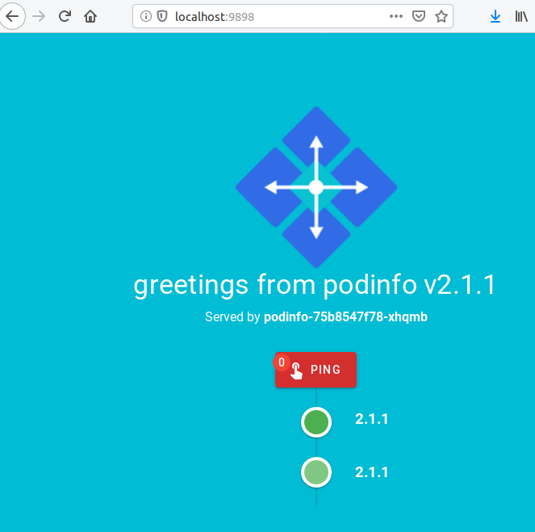

# GitOps with Flux v1

!!! Tip "New"
    Experimental support for [Flux v2 (part of the GitOps Toolkit)](https://toolkit.fluxcd.io/)
    is available from `eksctl` version `0.38.0`. See [the v2 docs](/usage/gitops-v2).

!!! Warning "Flux v1 support Deprecated"
    As full support for Flux v2 (GitOps Toolkit) has now been rolled out, Flux v1 (Repo, Operator, BootstrapProfile) functionality
    is now deprecated. Any significant changes or disruptions will be noted in [releases](https://github.com/weaveworks/eksctl/releases).

[Gitops][gitops] is a way to do Kubernetes application delivery. It
works by using Git as a single source of truth for Kubernetes resources
and everything else. With Git at the center of your delivery pipelines,
you and your team can make pull requests to accelerate and simplify
application deployments and operations tasks to Kubernetes.

[gitops]: https://www.weave.works/technologies/gitops/

## Installing Flux v1

`eksctl` provides an easy way to set up gitops in an existing cluster with the `eksctl enable repo` command.

The main point of gitops is to keep everything (config, alerts, dashboards,
apps, literally everything) in Git and use it as a single source of truth.


Installing [Flux v1](https://github.com/fluxcd/flux) on the cluster is the first step towards a gitops workflow.
To install it, you need a Git repository so first please go ahead and create an
_empty_ repository. On GitHub, for example, follow [these steps][github-repo].

[github-repo]: https://help.github.com/articles/create-a-repo

To install Flux v1 on an existing cluster, use the `enable repo` command:

```console
eksctl enable repo \
    --cluster=<cluster_name> \
    --region=<region> \
    --git-url=<git_repo> \
    --git-email=<git_user_email>
```

Or use a config file:

```YAML
---
apiVersion: eksctl.io/v1alpha5
kind: ClusterConfig

metadata:
  name: cluster-21
  region: eu-north-1

# other cluster config ...

git:
  repo:
    url: "git@github.com:myorg/cluster-21.git"
    branch: master
    fluxPath: "flux/"
    user: "gitops"
    email: "<username>@users.noreply.github.com"
  operator:
    namespace: "flux"
    withHelm: true
```

Then:
```console
eksctl enable repo -f cluster-21.yaml
```

To install Flux v1 components into a new cluster as part of a `create cluster`
operation, simply add the above configuration to your config file, and run the create
command as normal.

Note that, by default, `eksctl enable repo` installs [Flux Helm Operator](https://github.com/fluxcd/helm-operator) with Helm v3 support.
To disable the installation of the Helm Operator, pass the flag `--with-helm=false` or set `git.operator.withHelm` to `false`.

Full example:

```console
eksctl enable repo --cluster=cluster-1 --region=eu-west-2  --git-url=git@github.com:weaveworks/cluster-1-gitops.git  --git-email=<username>@users.noreply.github.com --namespace=flux
[ℹ]  Generating manifests
[ℹ]  Cloning git@github.com:weaveworks/cluster-1-gitops.git
Cloning into '/var/folders/zt/sh1tk7ts24sc6dybr5z9qtfh0000gn/T/eksctl-install-flux-clone-142184188'...
[ℹ]  Writing Flux manifests
[ℹ]  Applying manifests
[ℹ]  created "Namespace/flux"
[ℹ]  created "flux:Secret/flux-git-deploy"
[ℹ]  created "flux:Deployment.apps/memcached"
[ℹ]  created "flux:ServiceAccount/flux"
[ℹ]  created "ClusterRole.rbac.authorization.k8s.io/flux"
[ℹ]  created "ClusterRoleBinding.rbac.authorization.k8s.io/flux"
[ℹ]  created "CustomResourceDefinition.apiextensions.k8s.io/helmreleases.helm.fluxcd.io"
[ℹ]  created "flux:Deployment.apps/flux"
[ℹ]  created "flux:Service/memcached"
[ℹ]  created "flux:Deployment.apps/flux-helm-operator"
[ℹ]  created "flux:ServiceAccount/flux-helm-operator"
[ℹ]  created "ClusterRole.rbac.authorization.k8s.io/flux-helm-operator"
[ℹ]  created "ClusterRoleBinding.rbac.authorization.k8s.io/flux-helm-operator"
[ℹ]  Waiting for Helm Operator to start
[ℹ]  Helm Operator started successfully
[ℹ]  Waiting for Flux to start
[ℹ]  Flux started successfully
[ℹ]  Committing and pushing manifests to git@github.com:weaveworks/cluster-1-gitops.git
[master ec43024] Add Initial Flux configuration
 Author: Flux <username@users.noreply.github.com>
14 files changed, 694 insertions(+)
Enumerating objects: 11, done.
Counting objects: 100% (11/11), done.
Delta compression using up to 4 threads
Compressing objects: 100% (6/6), done.
Writing objects: 100% (6/6), 2.09 KiB | 2.09 MiB/s, done.
Total 6 (delta 3), reused 0 (delta 0)
remote: Resolving deltas: 100% (3/3), completed with 3 local objects.
To github.com:weaveworks/cluster-1-gitops.git
   5fe1eb8..ec43024  master -> master
[ℹ]  Flux will only operate properly once it has write-access to the Git repository
[ℹ]  please configure git@github.com:weaveworks/cluster-1-gitops.git  so that the following Flux SSH public key has write access to it
ssh-rsa AAAAB3NzaC1yc2EAAAADAQABAAABAQDYYsPuHzo1L29u3zhr4uAOF29HNyMcS8zJmOTDNZC4EiIwa5BXgg/IBDKudxQ+NBJ7mknPlNv17cqo4ncEq1xiQidfaUawwx3xxtDkZWam5nCBMXEJwkr4VXx/6QQ9Z1QGXpaFwdoVRcY/kM4NaxM54pEh5m43yeqkcpRMKraE0EgbdqFNNARN8rIEHY/giDorCrXp7e6AbzBgZSvc/in7Ul9FQhJ6K4+7QuMFpJt3O/N8KDumoTG0e5ssJGp5L1ugIqhzqvbHdmHVfnXsEvq6cR1SJtYKi2GLCscypoF3XahfjK+xGV/92a1E7X+6fHXSq+bdOKfBc4Z3f9NBwz0v
```

The only thing left to do is to give Flux write access to the repository.
Copy the lines starting with `ssh-rsa` and give it read/write access to your
repository. For example, in GitHub, by adding it as a deploy key. There you
can easily do this in the `Settings > Deploy keys > Add deploy key`. Just
make sure you check `Allow write access` as well.

At this point Flux and the Helm Operator should be installed in the specified cluster.

```console
$ kubectl get pods --namespace flux
NAME
flux-699cc7f4cb-9qc45
memcached-958f745c-qdfgz
flux-helm-operator-6bc7c85bb5-l2nzn
```

CLI arguments for `eksctl enable repo`

| Flag                              | Default value | Type    | Required | Use                                                                                                                          |
|-----------------------------------|---------------|---------|----------|------------------------------------------------------------------------------------------------------------------------------|
| `--cluster`                       |               | string  | required | name of the EKS cluster                                                                                                      |
| `--region`                        |               | string  | required | AWS region                                                                                                                   |
| `--git-url`                       |               | string  | required | SSH URL of the Git repository to be used for GitOps                                                                          |
| `--git-branch`                    | master        | string  | optional | Git branch to be used for GitOps                                                                                             |
| `--git-email`                     |               | string  | required | Email to use as Git committer                                                                                                |
| `--git-user`                      | Flux          | string  | optional | Username to use as Git committer                                                                                             |
| `--git-private-ssh-key-path`      |               | string  | optional | Optional path to the private SSH key to use with Git                                                                         |
| `--git-paths`                     |               | string  | optional | Relative paths within the Git repo for Flux to locate Kubernetes manifests                                                   |
| `--git-label`                     | flux          | string  | optional | Git label to keep track of Flux's sync progress; this is equivalent to overriding --git-sync-tag and --git-notes-ref in Flux |
| `--git-flux-subdir`               | flux/         | string  | optional | Directory within the Git repository where to commit the Flux manifests                                                       |
| `--namespace`                     | flux          | string  | optional | Cluster namespace where to install Flux and the Helm Operator                                                                |
| `--with-helm`                     | true          | boolean | optional | Install the Helm Operator                                                                                                    |
| `--commit-operator-manifests`     | true          | boolean | optional | Commit and push Flux manifests to the Git repo on install                                                                    |
| `--read-only`                     | false         | boolean | optional | Configure Flux in read-only mode and create the deploy key in read-only mode (only for Github)                               |
| `--additional-flux-args`          |               | string  | optional | Additional command line arguments for the Flux daemon                                                                        |
| `--additional-helm-operator-args` |               | string  | optional | Additional command line arguments for the Helm Operator                                                                      |

#### Adding a workload

To deploy a new workload on the cluster using gitops just add a kubernetes manifest to the repository. After a few
minutes you should see the resources appearing in the cluster.


## Installing a Quickstart profile in your cluster

In this part of the guide we will show you how to launch fully-configured Kubernetes
clusters that are ready to run production workloads in minutes.
At the end of this, you will have a Kubernetes cluster including control
plane, worker nodes, and all of the software needed for code deployment,
monitoring, and logging.


The following command will set up your cluster with the
[app-dev](https://github.com/weaveworks/eks-quickstart-app-dev) profile,
the first gitops Quick Start. All of the config files you need for a
production-ready cluster will be in the git repo you have provided and
those components will be deployed to your cluster. When you make changes
in the configuration they will be reflected on your cluster.

```console
eksctl enable profile \
    --cluster <cluster-name> \
    --region <region> \
    --git-url=<url_to_your_repo> \
    --git-email=<your-email> \
    app-dev
```

or with a config file similar to the `enable repo` config, with the addition of
`bootstrapProfile` configuration:

```YAML
---
apiVersion: eksctl.io/v1alpha5
kind: ClusterConfig

metadata:
  name: cluster-21
  region: eu-north-1

# other cluster config ...

git:
  repo:
    url: "git@github.com:myorg/cluster-21.git"
    branch: master
    fluxPath: "flux/"
    user: "gitops"
    email: "<username>@users.noreply.github.com"
  operator:
    namespace: "flux"
    withHelm: true
  bootstrapProfile:
    source: app-dev
    revision: master
```

To install your Quickstart components into a new cluster as part of a `create cluster`
operation, simply add the above configuration to your config file, and run the create
command as normal.

The `enable profile` command will create a temporary clone of the specified repository and then it will follow these steps:

  1. add the component manifests of the Quick Start profile to your repository inside the `base/` folder
  2. template values (eg cluster name) into configuration so that components can work
  3. commit the Quick Start files and push the changes to the origin remote
  4. Flux will install the components from the `base/` folder into your cluster

Example:

```
eksctl enable profile --cluster production-cluster --region eu-north-1 --git-url=git@github.com:myorg/production-kubernetes --git-email=<username>@users.noreply.github.com app-dev
Cloning into '/tmp/gitops-repos/flux-test-3'...
Resolving deltas: 100% (37/37), done.
[ℹ]  cloning repository "git@github.com:weaveworks/eks-quickstart-app-dev.git":master
Cloning into '/tmp/quickstart-365477450'...
Resolving deltas: 100% (53/53), done.
[ℹ]  processing template files in repository
[ℹ]  writing new manifests to "/tmp/gitops-repos/flux-test-3/base"
[master d0810f7] Add app-dev quickstart components
 Author: Flux <>
 27 files changed, 1207 insertions(+)
 create mode 100644 base/LICENSE
 create mode 100644 base/README.md
 create mode 100644 base/amazon-cloudwatch/cloudwatch-agent-configmap.yaml
 create mode 100644 base/amazon-cloudwatch/cloudwatch-agent-daemonset.yaml
 create mode 100644 base/amazon-cloudwatch/cloudwatch-agent-rbac.yaml
 create mode 100644 base/amazon-cloudwatch/fluentd-configmap-cluster-info.yaml
 create mode 100644 base/amazon-cloudwatch/fluentd-configmap-fluentd-config.yaml
 create mode 100644 base/amazon-cloudwatch/fluentd-daemonset.yaml
 create mode 100644 base/amazon-cloudwatch/fluentd-rbac.yaml
 create mode 100644 base/demo/helm-release.yaml
 create mode 100644 base/kube-system/alb-ingress-controller-deployment.yaml
 create mode 100644 base/kube-system/alb-ingress-controller-rbac.yaml
 create mode 100644 base/kube-system/cluster-autoscaler-deployment.yaml
 create mode 100644 base/kube-system/cluster-autoscaler-rbac.yaml
 create mode 100644 base/kubernetes-dashboard/dashboard-metrics-scraper-deployment.yaml
 create mode 100644 base/kubernetes-dashboard/dashboard-metrics-scraper-service.yaml
 create mode 100644 base/kubernetes-dashboard/kubernetes-dashboard-configmap.yaml
 create mode 100644 base/kubernetes-dashboard/kubernetes-dashboard-deployment.yaml
 create mode 100644 base/kubernetes-dashboard/kubernetes-dashboard-rbac.yaml
 create mode 100644 base/kubernetes-dashboard/kubernetes-dashboard-secrets.yaml
 create mode 100644 base/kubernetes-dashboard/kubernetes-dashboard-service.yaml
 create mode 100644 base/monitoring/metrics-server.yaml
 create mode 100644 base/monitoring/prometheus-operator.yaml
 create mode 100644 base/namespaces/amazon-cloudwatch.yaml
 create mode 100644 base/namespaces/demo.yaml
 create mode 100644 base/namespaces/kubernetes-dashboard.yaml
 create mode 100644 base/namespaces/monitoring.yaml
Counting objects: 36, done.
Delta compression using up to 4 threads.
Compressing objects: 100% (27/27), done.
Writing objects: 100% (36/36), 11.17 KiB | 3.72 MiB/s, done.
Total 36 (delta 8), reused 27 (delta 8)
remote: Resolving deltas: 100% (8/8), done.
To github.com:myorg/production-kubernetes
   0985830..d0810f7  master -> master

```

Flux will pick up the changes in the repository with the Quick Start components and deploy them to the cluster.
After a couple of minutes the pods should appear in the cluster:

```
$ kubectl get pods --all-namespaces
NAMESPACE              NAME                                                      READY   STATUS                       RESTARTS   AGE
amazon-cloudwatch      cloudwatch-agent-qtdmc                                    1/1     Running                      0           4m28s
amazon-cloudwatch      fluentd-cloudwatch-4rwwr                                  1/1     Running                      0           4m28s
demo                   podinfo-75b8547f78-56dll                                  1/1     Running                      0          103s
flux                   flux-56b5664cdd-nfzx2                                     1/1     Running                      0          11m
flux                   flux-helm-operator-6bc7c85bb5-l2nzn                       1/1     Running                      0          11m
flux                   memcached-958f745c-dqllc                                  1/1     Running                      0          11m
kube-system            alb-ingress-controller-6b64bcbbd8-6l7kf                   1/1     Running                      0          4m28s
kube-system            aws-node-l49ct                                            1/1     Running                      0          14m
kube-system            cluster-autoscaler-5b8c96cd98-26z5f                       1/1     Running                      0          4m28s
kube-system            coredns-7d7755744b-4jkp6                                  1/1     Running                      0          21m
kube-system            coredns-7d7755744b-ls5d9                                  1/1     Running                      0          21m
kube-system            kube-proxy-wllff                                          1/1     Running                      0          14m
kubernetes-dashboard   dashboard-metrics-scraper-f7b5dbf7d-rm5z7                 1/1     Running                      0          4m28s
kubernetes-dashboard   kubernetes-dashboard-7447f48f55-94rhg                     1/1     Running                      0          4m28s
monitoring             alertmanager-prometheus-operator-alertmanager-0           2/2     Running                      0          78s
monitoring             metrics-server-7dfc675884-q9qps                           1/1     Running                      0          4m24s
monitoring             prometheus-operator-grafana-9bb769cf-pjk4r                2/2     Running                      0          89s
monitoring             prometheus-operator-kube-state-metrics-79f476bff6-r9m2s   1/1     Running                      0          89s
monitoring             prometheus-operator-operator-58fcb66576-6dwpg             1/1     Running                      0          89s
monitoring             prometheus-operator-prometheus-node-exporter-tllwl        1/1     Running                      0          89s
monitoring             prometheus-prometheus-operator-prometheus-0               3/3     Running                      1          72s
```

If you fetch the latest changes to your configuration repository,
you will see that eksctl has updated it with the templated files from the
Quick Start. The next time Flux syncs from this repo, it will start updating
the cluster with the current configuration.

It's easy to confirm that all the [eks-quickstart-app-dev components](https://github.com/weaveworks/eks-quickstart-app-dev#components)
are up and running for you by checking the `podinfo` app:

```console
kubectl get service --namespace demo
```

```console
NAME      TYPE        CLUSTER-IP       EXTERNAL-IP   PORT(S)    AGE
podinfo   ClusterIP   10.100.255.220   <none>        9898/TCP   2m
```

Now let's port-forward the service, so we can easily access it:

```console
kubectl port-forward -n demo svc/podinfo 9898:9898
```

If you open `localhost:9898` in your browser, you will see



For any further changes you wish to make to your cluster you can simply PR more
manifests to your repo, and let Flux take care of the rest.

All CLI arguments for `gitops enable profile`:

| Flag                         | Default value | Type   | Required       | Use                                                              |
|------------------------------|---------------|--------|----------------|------------------------------------------------------------------|
| `--cluster`                  |               | string | required       | Name of the EKS cluster                 |
| `--region`                   |               | string | required       | AWS region where the cluster exists                              |
| `--profile-source`           |               | string | required       | Name or URL of the Quickstart profile. For example, app-dev      |
| `<name positional argument>`   |               | string | required       | Same as `--profile-source`                                       |
| `--profile-revision`         | master        | string | optional       | Git Branch of the Quickstart profile repository                  |
| `--git-url`                  |               | string | required       | URL                                                              |
| `--git-branch`               | master        | string | optional       | Git branch                                                       |
| `--git-user`                 | Flux          | string | optional       | Username to use to commit to the Gitops repo                     |
| `--git-email`                |               | string | required       | Email to use to commit to the Gitops repo                        |
| `--git-private-ssh-key-path` |               | string | optional       | Optional path to the private SSH key to use with the gitops repo |


#### Further reading

To learn more about gitops and Flux, check the Flux documentation for [v1](https://docs.fluxcd.io/en/1.21.1/).

### Installing components from a Quickstart profile on a specific directory without pushing

To install the components from a Quickstart profile in a specified folder without committing and pushing to a Gitops
repo the `generate profile` command can be used:

```console
eksctl generate profile \
    --cluster=<cluster-name> \
    --region=<region> \
    --profile-source git@github.com:weaveworks/eks-quickstart-app-dev.git \
    --profile-path <output_directory>
```

For example:
```console
Cloning into '/tmp/cluster-21-086715755'...
remote: Enumerating objects: 10, done.
remote: Counting objects: 100% (10/10), done.
remote: Compressing objects: 100% (10/10), done.
remote: Total 187 (delta 2), reused 8 (delta 0), pack-reused 177
Receiving objects: 100% (187/187), 45.18 KiB | 616.00 KiB/s, done.
Resolving deltas: 100% (86/86), done.
Already on 'master'
Your branch is up to date with 'origin/master'.
[ℹ]  cloning repository "https://github.com/weaveworks/eks-quickstart-app-dev":master
Cloning into '/tmp/quickstart-424579534'...
remote: Enumerating objects: 214, done.
remote: Total 214 (delta 0), reused 0 (delta 0), pack-reused 214
Receiving objects: 100% (214/214), 57.06 KiB | 446.00 KiB/s, done.
Resolving deltas: 100% (93/93), done.
Already on 'master'
Your branch is up to date with 'origin/master'.
[ℹ]  processing template files in repository
[ℹ]  writing new manifests to "base/"
```

```console
$ tree my-gitops-repo/base
$ tree base/
base/
├── amazon-cloudwatch
│   ├── cloudwatch-agent-configmap.yaml
│   ├── cloudwatch-agent-daemonset.yaml
│   ├── cloudwatch-agent-rbac.yaml
│   ├── fluentd-configmap-cluster-info.yaml
│   ├── fluentd-configmap-fluentd-config.yaml
│   ├── fluentd-daemonset.yaml
│   └── fluentd-rbac.yaml
├── demo
│   └── helm-release.yaml
├── kubernetes-dashboard
│   ├── dashboard-metrics-scraper-deployment.yaml
│   ├── dashboard-metrics-scraper-service.yaml
│   ├── kubernetes-dashboard-configmap.yaml
│   ├── kubernetes-dashboard-deployment.yaml
│   ├── kubernetes-dashboard-rbac.yaml
│   ├── kubernetes-dashboard-secrets.yaml
│   └── kubernetes-dashboard-service.yaml
├── kube-system
│   ├── alb-ingress-controller-deployment.yaml
│   ├── alb-ingress-controller-rbac.yaml
│   ├── cluster-autoscaler-deployment.yaml
│   └── cluster-autoscaler-rbac.yaml
├── LICENSE
├── monitoring
│   ├── metrics-server.yaml
│   └── prometheus-operator.yaml
├── namespaces
│   ├── amazon-cloudwatch.yaml
│   ├── demo.yaml
│   ├── kubernetes-dashboard.yaml
│   └── monitoring.yaml
└── README.md

```

```console
cd my-gitops-repo/
git add .
git commit -m "Add component templates"
git push origin master
```

After a few minutes, Flux and Helm should have installed all the components in your cluster.

## Creating your own Quick Start profile

A Quick Start profile is a Git repository that contains Kubernetes manifests that can be installed in a cluster using
gitops (through [Flux][flux]).

Some components will probably need some information about the cluster they will be installed in, such as the cluster
name or the AWS region. We can template these in via the manifests you add to your profile using [Go templates][go-templates].

The variables that can be templated are shown below:

| Name                | Template               |
|---------------------|------------------------|
| cluster name        | `{{ .ClusterName }}`   |
| cluster region      | `{{ .Region }}`        |


For example, we could create a config map using these variables:

```yaml
apiVersion: v1
data:
  cluster.name: {{ .ClusterName }}
  logs.region: {{ .Region }}
kind: ConfigMap
metadata:
  name: cluster-info
  namespace: my-namespace
```

Write this into a file with the extension `*.yaml.tmpl` and commit it to your Quick Start repository.
Files with this extension get processed by eksctl before committing them to the user's gitops repository, while the rest get copied unmodified.

Regarding the folder structure inside the Quick Start repository, we recommend using a folder for each `namespace` and
one file per Kubernetes resource.

```
repository-name/
├── kube-system
│   ├── ingress-controller-deployment.yaml.tmpl
│   └── ingress-controller-rbac.yaml.tmpl
└── alerting
    ├── alerting-app-deployment.yaml
    ├── alerting-app-service.yaml.tmpl
    ├── monitoring-sidecar-deployment.yaml
    ├── monitoring-sidecar-service.yaml.tmpl
    ├── cluster-info-configmap.yaml.tmpl
    └── alerting-namespace.yaml

```

Note that some files have the extension `*.yaml` while others have `*.yaml.tmpl`. The last ones are the ones that can
contain template actions while the former are plain `yaml` files.

These files can now be committed and pushed to your Quick Start repository, for example `git@github.com:myorg/production-infra`.

```
cd repository-name/
git add .
git commit -m "Add component templates"
git push origin master
```

Now that the templates are in the remote repository, the Quick Start is ready to be used with `eksctl enable profile`:

```console
eksctl enable profile --cluster team1 --region eu-west-1 --git-url git@github.com:myorg/team1-cluster --git-email <username>@users.noreply.github.com git@github.com:myorg/production-infra
```

In this example we provide `github.com:myorg/production-infra` as the Quick Start profile and
`github.com:myorg/team1-cluster` as the gitops repository that is connected to the Flux instance in the cluster named
`cluster1`.

For a full example of a Quick Start profile, check out [App Dev][app-dev].

All CLI arguments for `gitops generate profile`:

| Flag                         | Default value | Type   | Required       | Use                                                              |
|------------------------------|---------------|--------|----------------|------------------------------------------------------------------|
| `--cluster`                  |               | string | required       | Name of the EKS cluster                 |
| `--region`                   |               | string | required       | AWS region where the cluster exists                              |
| `--profile-source`           |               | string | required       | Name or URL of the Quickstart profile. For example, app-dev      |
| `--profile-revision`         | master        | string | optional       | Git Branch of the Quickstart profile repository                  |
| `--profile-path`             | ./<quickstart-repo-name\>        | string | optional       | Path to generate the profile in                   |
| `<name positional argument>`   |               | string | required       | Same as `--profile-source`                                       |


[flux]: https://docs.fluxcd.io/en/latest/
[go-templates]: https://golang.org/pkg/text/template/
[app-dev]: https://github.com/weaveworks/eks-quickstart-app-dev
